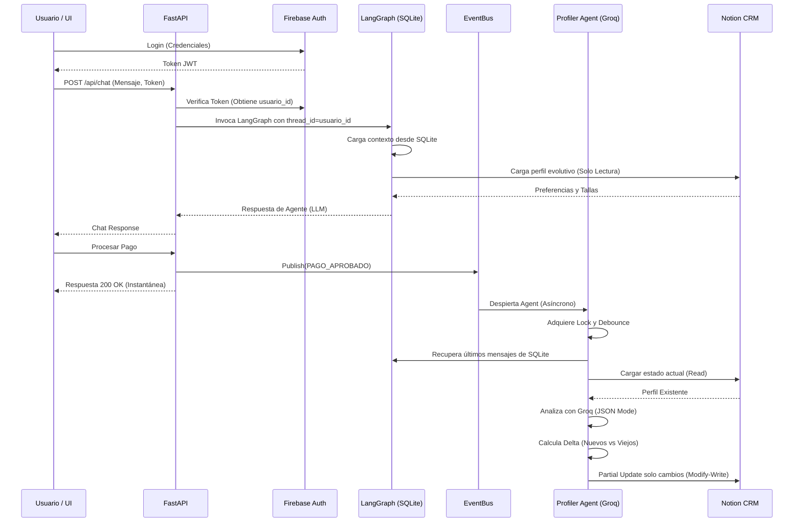

# Arquitectura Técnica y Memoria Evolutiva (Fase 3)

Este documento detalla la arquitectura técnica de AURA Boutique, con especial énfasis en el sistema de **Memoria Evolutiva (Profiler Agent)** implementado en la Fase 3, el cual complementa al sistema de orquestación multi-agente basado en LangGraph.

## 1. Arquitectura General del Sistema

El sistema AURA Boutique se divide en las siguientes capas principales:
1. **Frontend**: HTML/JS/CSS vainilla consumido desde FastAPI, que incluye integración con Firebase para Autenticación.
2. **Backend (FastAPI)**: Orquesta las solicitudes HTTP, mantiene el `EventBus`, y sirve de puente hacia LangGraph.
3. **LangGraph (Corto Plazo)**: Grafo conversacional que orquesta al Agente Supervisor y a los agentes especialistas (Catálogo, Inventario, Ventas, etc.). Utiliza un **Checkpointer SQLite** para mantener el estado y contexto de la conversación (memoria a corto plazo).
4. **Profiler Agent (Largo Plazo)**: Tarea asíncrona en segundo plano que escucha eventos (ej: `PAGO_APROBADO`), analiza el historial conversacional mediante un LLM (Groq `llama-3.1`), extrae conclusiones semánticas y actualiza el CRM.
5. **Capa de Datos Externa**:
    *   **Firebase**: Identidad de usuario y tokens de sesión.
    *   **Notion**: CRM headless que alberga las bases de datos `CLIENTES` (Perfil e Insights) y `ÓRDENES` (Transacciones).

---

## 2. Flujo Completo de LangGraph y Checkpointer SQLite

El corazón conversacional de AURA es `web/lc_adapter.py` y `graph/builder.py`.

*   **Flujo del Grafo**: Cuando un usuario envía un mensaje, el input se introduce en un nodo `Supervisor`. Éste decide si él mismo responde o si delega la acción a un especialista mediante LangChain Tools. El resultado fluye de regreso al usuario.
*   **Memoria a Corto Plazo (SQLite)**: 
    *   Se utiliza `AsyncSqliteSaver` de LangGraph para almacenar automáticamente cada mensaje, llamada a herramienta y respuesta del LLM. 
    *   Esta memoria está particionada por `thread_id` (que mapea al `usuario_id`). 
    *   Provee un contexto continuo para la sesión de compras actual sin sobrecargar la ventana de contexto permanente.

---

## 3. Integración con Firebase (Auth)

*   **Identidad Inmutable**: El Frontend utiliza el SDK de Firebase para validar correos/contraseñas y obtener un JWT.
*   **Validación FastAPI**: `web/api.py` cuenta con un middleware/dependency que decodifica el token de Firebase. Este `usuario_id` (UUID de Firebase) es el hilo conductor (Thread ID) en LangGraph y el Primary Key en Notion.

---

## 4. Integración con Notion (CRM y ÓRDENES)

El sistema utiliza la API oficial de Notion (`notion-client`) en `server/notion_client.py`.
*   **Base ÓRDENES**: Cuando un pago se aprueba, se inserta una fila completa representando el voucher y la transacción.
*   **Base CLIENTES**: Actúa como un CRM híbrido gestionado por humanos e IA.
    *   Campos Humanos: Nombre, Email, Nivel de Fidelización.
    *   Campos IA (Profiler): Preferencias, Tallas Habituales, Resumen Evolutivo.

---

## 5. Arquitectura del Profiler Agent (Memoria Evolutiva)

El Profiler Agent (`agents/profiler_agent.py`) es la joya de la Fase 3. Otorga al sistema **Memoria Semántica a Largo Plazo** extrayendo valor comercial del "Ruido" de las conversaciones.

### Flujo de Lectura y Escritura del Perfil
1.  **Activación**: Es despertado por el `EventBus` sin interrumpir la respuesta web del usuario.
2.  **Extracción de Historial**: Llama a `LC_ADAPTER.get_raw_history(usuario_id)` para recuperar los últimos 20 mensajes (filtrando mensajes irrelevantes de herramientas para ahorrar tokens).
3.  **Análisis Estructurado (JSON Mode)**: Envía este historial crudo junto con el estado de Notion actual a un LLM (`llama-3.1-8b-instant`), obligándolo a devolver un modelo `PerfilDelta` en JSON.
4.  **Escritura**: Ejecuta una fusión y envía los cambios a Notion.

### Mecanismos Avanzados de Seguridad y Consistencia

*   **Read-Modify-Write**: El Profiler **nunca** asume un estado vacío. Siempre lee el perfil más reciente desde Notion, se lo envía al LLM como estado "actual", y le pide al LLM que construya un nuevo estado *basado en el anterior*.
*   **Mecanismo Delta**: Antes de llamar a la API de Notion para escribir, el código compara el estado original (Set de strings) contra el resultado del LLM. Si no hay cambios semánticos reales (Ej: la preferencia "Casacas" ya existía y el LLM devolvió "Casacas"), el Profiler desecha la escritura para ahorrar cuota de API.
*   **Partial Update**: La escritura a Notion solo incluye las propiedades (columnas) presentes en el Delta. Esto asegura **Soberanía de Datos**, garantizando que la IA nunca sobrescriba el estado de fidelidad gestionado por un administrador humano.
*   **Locks (asyncio.Lock)**: Para prevenir *Race Conditions* (ej: un usuario da múltiples clics de pago rápidos), cada análisis se ejecuta dentro de un Lock asíncrono mapeado por `usuario_id`.
*   **Debounce**: Si el Profiler recibe 5 eventos del mismo usuario en 2 segundos, el sistema cancelará silenciosamente los 4 análisis previos en `_debounce_timers` y ejecutará únicamente el último, garantizando eficiencia de cómputo.

---

## 6. Funcionamiento del EventBus

Implementado en `agents/event_bus.py`, proporciona un mecanismo síncrono/asíncrono de publicación y suscripción.
1.  **Publish**: El backend (ej: pago.aprobado) publica un `Evento`.
2.  **Subscribe**: El Profiler Agent registra un callback mediante `BUS.subscribe()`.
3.  **Desacoplamiento**: El EventBus dispara el evento, pero el Profiler delega el procesamiento pesado a un `asyncio.create_task()`, dejando la respuesta HTTP libre para completarse instantáneamente.

---

## 7. Diagrama de Flujo Completo (E2E)

---

## 8. Guía de Extensión

### Cómo agregar nuevos Agentes en el futuro
1.  En `graph/builder.py`, crea una nueva instancia de `create_react_agent` con las herramientas (tools) correspondientes.
2.  Actualiza el prompt del `supervisor_node` para que conozca al nuevo agente y sepa cuándo rutear hacia él.
3.  Añade la arista de navegación en `workflow.add_edge("nuevo_agente", "supervisor")`.

### Cómo agregar nuevos Eventos al EventBus
1.  Agrega el nuevo evento al enum `EventType` en `agents/event_bus.py` (Ej: `CARRITO_ABANDONADO`).
2.  En el controlador donde suceda la acción (ej: FastAPI), invoca `BUS.publish(EventType.CARRITO_ABANDONADO, datos={...})`.
3.  El `ProfilerAgent` o cualquier otro módulo puede suscribirse a ese evento en su `__init__` con `BUS.subscribe(EventType.CARRITO_ABANDONADO, self.metodo)`.

### Cómo extender el Profiler (Nuevos campos evolutivos)
1.  Abre `agents/profiler_agent.py` y añade el nuevo campo al schema de Pydantic `PerfilDelta` (Ej: `marcas_odiadas: list[str]`).
2.  Actualiza el `PROMPT_PROFILER` para explicarle al LLM cómo debe inferir este campo.
3.  Actualiza la lógica del "Mecanismo Delta" para comparar `marcas_actuales` con `marcas_nuevas`.
4.  Crea la columna en tu base de datos de Notion y añade el alias a `get_col()` en `server/notion_client.py`.
